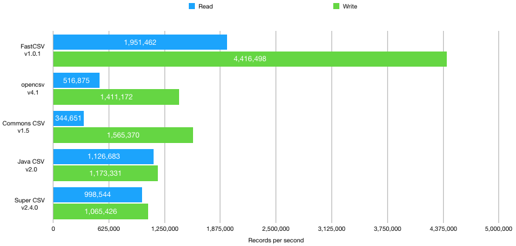

FastCSV
=======

[](https://travis-ci.org/osiegmar/FastCSV)
[](https://maven-badges.herokuapp.com/maven-central/de.siegmar/fastcsv)

FastCSV is a ultra fast and simple [RFC 4180](https://tools.ietf.org/html/rfc4180) compliant CSV
library for Java, licensed under the Apache License, Version 2.0.


## Benchmark

Benchmark from the
[Java CSV library benchmark suite](https://github.com/osiegmar/JavaCsvBenchmarkSuite) project:




Features
--------

- RFC 4180 compliant CSV reader and writer
- Ultra fast
- Small footprint
- Zero runtime dependencies
- Configurable field separator
- Configurable text delimiter
- Support for line endings CRLF (Windows), CR (old Mac OS) and LF (Unix)
- Support for (optional) header lines (get field based on column name)
- Support for multiple line values (using the text delimiter)
- Support for field separator character in value (using the text delimiter)
- Support for reading and writing in an iterative or all at once way
- Support for skipping empty rows and preserving the original line number (useful for error messages)


Requirements
------------

- Java 7


CsvReader Examples
------------------

Iterative reading of a CSV file (RFC standard format, UTF-8 encoded)

```java
File file = new File("foo.csv");
CsvReader csvReader = new CsvReader();

try (CsvParser csvParser = csvReader.parse(file, StandardCharsets.UTF_8)) {
    CsvRow row;
    while ((row = csvParser.nextRow()) != null) {
        System.out.println("Read line: " + row);
        System.out.println("First column of line: " + row.getField(0));
    }
}
```

Read full CSV file at once (RFC standard format, UTF-8 encoded)

```java
File file = new File("foo.csv");
CsvReader csvReader = new CsvReader();

CsvContainer csv = csvReader.read(file, StandardCharsets.UTF_8);
for (CsvRow row : csv.getRows()) {
    System.out.println("Read line: " + row);
    System.out.println("First column of line: " + row.getField(0));
}
```


Read full CSV file with header at once (RFC standard format, UTF-8 encoded)

```java
File file = new File("foo.csv");
CsvReader csvReader = new CsvReader();
csvReader.setContainsHeader(true);

CsvContainer csv = csvReader.read(file, StandardCharsets.UTF_8);
for (CsvRow row : csv.getRows()) {
    System.out.println("First column of line: " + row.getField("name"));
}
```


Custom settings

```java
CsvReader csvReader = new CsvReader();
csvReader.setFieldSeparator(';');
csvReader.setTextDelimiter('\'');
```


CsvWriter Examples
------------------

Iterative writing of a CSV file (RFC standard format, UTF-8 encoded)

```java
File file = new File("foo.csv");
CsvWriter csvWriter = new CsvWriter();

try (CsvAppender csvAppender = csvWriter.append(file, StandardCharsets.UTF_8)) {
    // header
    csvAppender.appendLine("header1", "header2");

    // 1st line in one operation
    csvAppender.appendLine("value1", "value2");

    // 2nd line in split operations
    csvAppender.appendField("value3");
    csvAppender.appendField("value4");
    csvAppender.endLine();
}
```


Write full CSV file at once (RFC standard format, UTF-8 encoded)

```java
File file = new File("foo.csv");
CsvWriter csvWriter = new CsvWriter();

Collection<String[]> data = new ArrayList<>();
data.add(new String[] { "header1", "header2" });
data.add(new String[] { "value1", "value2" });

csvWriter.write(file, StandardCharsets.UTF_8, data);
```


Custom settings

```java
CsvWriter csvWriter = new CsvWriter();
csvWriter.setFieldSeparator(';');
csvWriter.setTextDelimiter('\'');
csvWriter.setLineDelimiter("\r\n".toCharArray());
csvWriter.setAlwaysDelimitText(true);
```


Contribution
------------

- Fork
- Code
- Add test(s)
- Commit
- Send me a pull request


Copyright
---------

Copyright 2020 Oliver Siegmar

Licensed under the Apache License, Version 2.0 (the "License");
you may not use this file except in compliance with the License.
You may obtain a copy of the License at

   http://www.apache.org/licenses/LICENSE-2.0

Unless required by applicable law or agreed to in writing, software
distributed under the License is distributed on an "AS IS" BASIS,
WITHOUT WARRANTIES OR CONDITIONS OF ANY KIND, either express or implied.
See the License for the specific language governing permissions and
limitations under the License.
